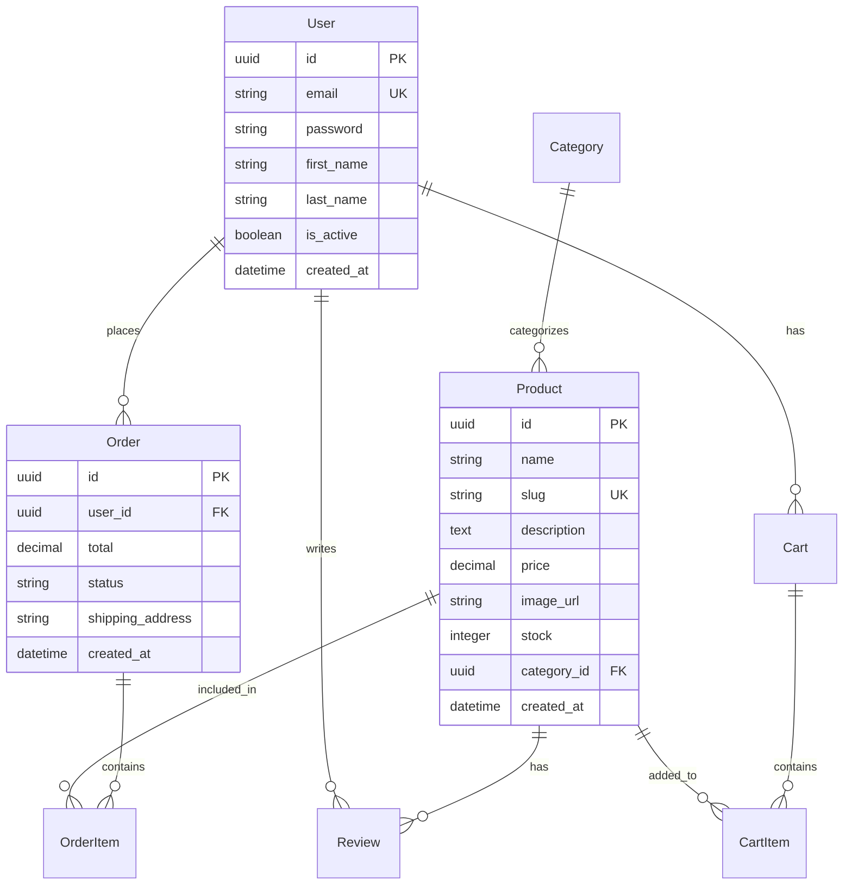

# 🛒 E-Commerce Platform

A modern, full-featured e-commerce platform built with Django REST Framework (Backend) and React (Frontend). This project provides a complete online shopping solution with user authentication, product catalog, shopping cart, and order management.


## ✨ Features

### 🛍️ **Core Features**
- **User Authentication & Authorization**
  - JWT-based authentication
  - User registration/login
  - Password reset functionality
  - Role-based permissions (Admin, Staff, Customer)

- **Product Management**
  - Full CRUD operations for products
  - Product categories and filtering
  - Image upload and management
  - Inventory tracking
  - Product reviews and ratings

- **Shopping Experience**
  - Advanced product search and filtering
  - Shopping cart with session persistence
  - Wishlist functionality
  - Product recommendations

- **Order Management**
  - Checkout process
  - Order history
  - Order status tracking
  - Invoice generation

### 🚀 **Advanced Features**
- **RESTful API** with OpenAPI documentation
- **Real-time inventory updates**
- **Product sorting and pagination**
- **Responsive design** for mobile and desktop
- **Secure payment integration** (Stripe/PayPal ready)
- **Email notifications** for order updates
- **Admin dashboard** with analytics
- **Docker containerization** for easy deployment

## 🏗️ Architecture

```
ecommerce/
├── backend/                 # Django REST API
│   ├── apps/
│   │   ├── accounts/       # User authentication
│   │   ├── catalog/        # Products, categories, cart
│   │   └── orders/         # Order management
│   ├── config/             # Django settings
│   └── requirements.txt    # Python dependencies
│
├── frontend/               # React Application
│   ├── src/
│   │   ├── components/     # Reusable UI components
│   │   ├── context/        # React context (cart, auth)
│   │   ├── pages/          # Page components
│   │   └── utils/          # Helper functions
│   └── package.json        # JavaScript dependencies
│
├── docker-compose.yml      # Multi-container setup
├── .env.example            # Environment variables
└── README.md               # This file
```

## 🚀 Quick Start

### Prerequisites
- Python 3.9+
- Node.js 16+
- PostgreSQL 13+
- Docker & Docker Compose (optional)

### Method 1: Docker (Recommended)

1. **Clone the repository**
   ```bash
   git clone https://github.com/fixeg683/E-Commerce-Backend.git
   cd E-Commerce-Backend
   ```

2. **Set up environment variables**
   ```bash
   cp .env.example .env
   # Edit .env with your configuration
   ```

3. **Start with Docker Compose**
   ```bash
   docker-compose up --build
   ```

4. **Access the applications**
   - Backend API: http://localhost:8000
   - Frontend: http://localhost:3000
   - API Documentation: http://localhost:8000/api/docs/
   - Admin Panel: http://localhost:8000/admin/

### Method 2: Manual Installation

#### Backend Setup
```bash
# Create virtual environment
python -m venv venv
source venv/bin/activate  # On Windows: venv\Scripts\activate

# Install dependencies
pip install -r requirements.txt

# Set up environment variables
cp .env.example .env
# Edit .env with your database credentials

# Run migrations
python manage.py migrate

# Create superuser
python manage.py createsuperuser

# Collect static files
python manage.py collectstatic

# Run development server
python manage.py runserver
```

#### Frontend Setup
```bash
cd frontend

# Install dependencies
npm install

# Set up environment
cp .env.example .env.local
# Edit .env.local with your API URL

# Start development server
npm run dev
```

## ⚙️ Environment Variables

### Backend (.env)
```env
# Django
DEBUG=True
SECRET_KEY=your-secret-key-here
BACKEND_BASE_URL=http://localhost:8000

# Database
POSTGRES_DB=ecommerce
POSTGRES_USER=postgres
POSTGRES_PASSWORD=postgres
POSTGRES_HOST=localhost
POSTGRES_PORT=5432

# Email (optional)
EMAIL_HOST=smtp.gmail.com
EMAIL_PORT=587
EMAIL_HOST_USER=your-email@gmail.com
EMAIL_HOST_PASSWORD=your-app-password

# Stripe (optional)
STRIPE_SECRET_KEY=sk_test_...
STRIPE_PUBLISHABLE_KEY=pk_test_...
```

### Frontend (.env.local)
```env
VITE_API_URL=http://localhost:8000/api
VITE_APP_NAME=E-Commerce Store
VITE_STRIPE_PUBLIC_KEY=pk_test_...
```

## 📚 API Documentation

The API is fully documented using OpenAPI/Swagger. After starting the server, visit:

- **Swagger UI**: http://localhost:8000/api/docs/
- **ReDoc**: http://localhost:8000/api/redoc/
- **OpenAPI Schema**: http://localhost:8000/api/schema/

### Key API Endpoints

| Method | Endpoint | Description |
|--------|----------|-------------|
| `POST` | `/api/auth/token/` | Get JWT tokens |
| `POST` | `/api/auth/token/refresh/` | Refresh JWT token |
| `GET` | `/api/catalog/products/` | List all products |
| `GET` | `/api/catalog/products/{slug}/` | Get product details |
| `POST` | `/api/catalog/products/` | Create product (admin) |
| `GET` | `/api/catalog/categories/` | List categories |
| `GET` | `/api/cart/` | Get user's cart |
| `POST` | `/api/cart/add_item/` | Add item to cart |
| `POST` | `/api/orders/checkout/` | Create order |

## 🗄️ Database Schema



## 🧪 Testing

### Backend Tests
```bash
# Run all tests
python manage.py test

# Run specific app tests
python manage.py test apps.catalog

# Run with coverage
coverage run manage.py test
coverage report
```

### Frontend Tests
```bash
cd frontend

# Run unit tests
npm test

# Run tests with coverage
npm test -- --coverage

# Run end-to-end tests
npm run test:e2e
```

## 🐳 Docker Deployment

### Production Deployment
```yaml
# docker-compose.prod.yml
version: '3.8'

services:
  backend:
    build: 
      context: .
      dockerfile: Dockerfile.prod
    ports:
      - "8000:8000"
    environment:
      - DATABASE_URL=postgres://...
      - REDIS_URL=redis://...
    depends_on:
      - postgres
      - redis

  frontend:
    build:
      context: ./frontend
      dockerfile: Dockerfile.prod
    ports:
      - "3000:80"

  postgres:
    image: postgres:14-alpine
    volumes:
      - postgres_data:/var/lib/postgresql/data

  redis:
    image: redis:7-alpine

  nginx:
    image: nginx:alpine
    ports:
      - "80:80"
      - "443:443"
    volumes:
      - ./nginx.conf:/etc/nginx/nginx.conf
      - ./ssl:/etc/nginx/ssl

volumes:
  postgres_data:
```

### Deploy to Production
```bash
# Build and deploy
docker-compose -f docker-compose.prod.yml up --build -d

# View logs
docker-compose -f docker-compose.prod.yml logs -f

# Run migrations
docker-compose -f docker-compose.prod.yml exec backend python manage.py migrate

# Collect static files
docker-compose -f docker-compose.prod.yml exec backend python manage.py collectstatic --noinput
```

## 📱 Frontend Features

### Components
- `Navbar`: Responsive navigation with cart counter
- `ProductCard`: Product display card with add-to-cart functionality
- `ProductList`: Grid layout for product listings
- `CartPage`: Shopping cart management
- `Checkout`: Multi-step checkout process
- `ProtectedRoute`: Route guarding for authenticated users

### State Management
- **React Context API** for global state
- **Cart Context**: Shopping cart state
- **Auth Context**: User authentication state
- **Theme Context**: UI theming

## 🔒 Security Features

- **JWT Authentication** with refresh tokens
- **CORS protection** with allowed origins
- **CSRF protection** for Django forms
- **SQL injection prevention** using ORM
- **XSS protection** with template auto-escaping
- **Secure password hashing** with bcrypt
- **Rate limiting** on API endpoints
- **HTTPS enforcement** in production

## 📊 Performance Optimization

- **Database indexing** on frequently queried fields
- **Query optimization** with `select_related` and `prefetch_related`
- **Pagination** for large datasets
- **Image optimization** with automatic resizing
- **Caching** with Redis
- **CDN integration** for static files
- **Lazy loading** for images

## 🤝 Contributing

We welcome contributions! Please follow these steps:

1. **Fork** the repository
2. **Create** a feature branch (`git checkout -b feature/AmazingFeature`)
3. **Commit** your changes (`git commit -m 'Add some AmazingFeature'`)
4. **Push** to the branch (`git push origin feature/AmazingFeature`)
5. **Open** a Pull Request

### Development Guidelines
- Follow [Django Coding Style](https://docs.djangoproject.com/en/dev/internals/contributing/writing-code/coding-style/)
- Write tests for new features
- Update documentation as needed
- Use meaningful commit messages

## 📝 Code Style

### Backend (Python)
```python
# Good
def calculate_total_price(items):
    """Calculate total price for items."""
    return sum(item.price * item.quantity for item in items)

# Bad
def calc(items):
    t=0
    for i in items:
        t+=i.price*i.qty
    return t
```

### Frontend (React)
```jsx
// Good
const ProductCard = ({ product, onAddToCart }) => {
  const handleClick = () => {
    onAddToCart(product);
  };

  return (
    <div className="product-card">
      
      <h3>{product.name}</h3>
      <button onClick={handleClick}>Add to Cart</button>
    </div>
  );
};

// Bad
const PC = ({p, add}) => {
  return <div><h3>{p.n}</h3><button onClick={()=>add(p)}>+</button></div>
}
```

## 🐛 Troubleshooting

### Common Issues

1. **Database Connection Error**
   ```bash
   # Check if PostgreSQL is running
   sudo service postgresql status
   
   # Create database if missing
   createdb ecommerce
   ```

2. **Port Already in Use**
   ```bash
   # Find process using port 8000
   sudo lsof -i :8000
   
   # Kill the process
   kill -9 <PID>
   ```

3. **Django Migration Errors**
   ```bash
   # Reset migrations (development only)
   python manage.py migrate --fake-initial
   python manage.py makemigrations
   python manage.py migrate
   ```

4. **Node Module Issues**
   ```bash
   # Clear npm cache and reinstall
   rm -rf node_modules package-lock.json
   npm cache clean --force
   npm install
   ```

## 📄 License

This project is licensed under the MIT License - see the [LICENSE](LICENSE) file for details.

## 🙏 Acknowledgments

- [Django](https://www.djangoproject.com/) - The web framework for perfectionists with deadlines
- [Django REST Framework](https://www.django-rest-framework.org/) - Powerful REST API toolkit
- [React](https://reactjs.org/) - A JavaScript library for building user interfaces
- [Tailwind CSS](https://tailwindcss.com/) - A utility-first CSS framework
- [PostgreSQL](https://www.postgresql.org/) - The world's most advanced open source database

## 📞 Support

For support, please:

1. Check the [documentation](https://github.com/fixeg683/E-Commerce-Backend/wiki)
2. Search [existing issues](https://github.com/fixeg683/E-Commerce-Backend/issues)
3. Create a [new issue](https://github.com/fixeg683/E-Commerce-Backend/issues/new)

---

<div align="center">
  <p>Made with ❤️ by the E-Commerce Team</p>
  <p>
    <a href="https://github.com/fixeg683/E-Commerce-Backend">GitHub</a> •
    <a href="https://github.com/fixeg683/E-Commerce-Backend/wiki">Documentation</a> •
    <a href="https://github.com/fixeg683/E-Commerce-Backend/issues">Issues</a>
  </p>
</div>
